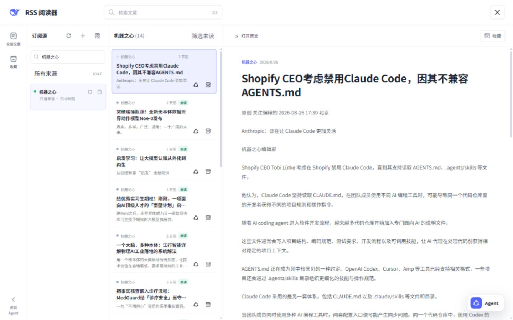
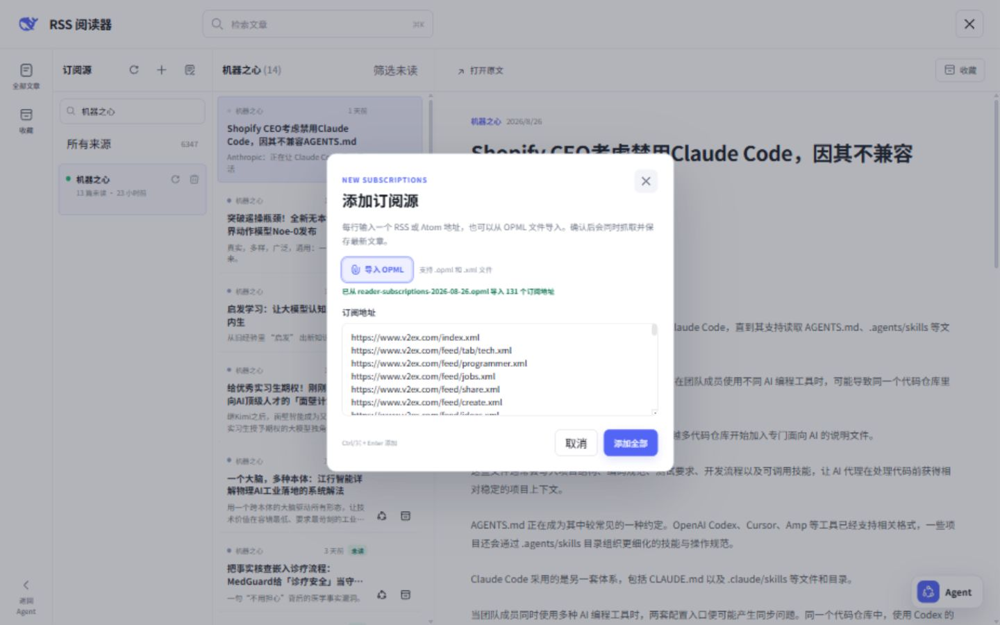
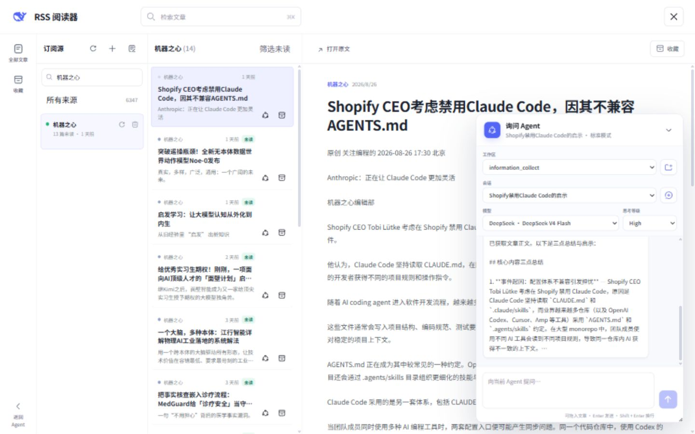
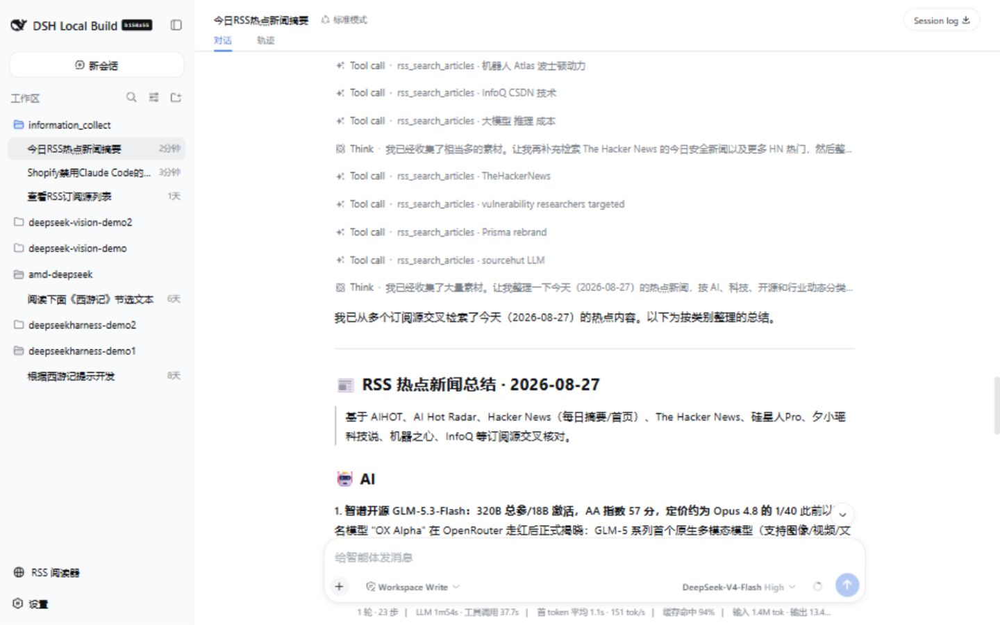

# DSH RSS

[English](README.md) | 中文

DSH RSS 是面向 [DeepSeek Harness](https://github.com/deepseek-ai/deepseek-harness) 的 RSS/Atom 阅读器插件。它提供全屏阅读工作区、本地 SQLite 存储、订阅源自动刷新，以及供 Harness 当前 Agent 使用的只读 RSS 工具。

插件直接复用 DeepSeek Harness 提供的 Agent、模型、Workspace、Session 和 Memory，不会另外创建一套 Agent 或会话系统。



## 功能

- 订阅 RSS 和 Atom Feed；
- 一次添加多个订阅源或导入 OPML 文件，并支持地址去重和失败重试；
- 手动刷新单个订阅源、刷新全部订阅源，或每小时自动刷新；
- 通过拖放或可访问的上下按钮手动排列订阅源，并将顺序保存到 SQLite；
- 搜索文章，并按订阅源、未读状态或收藏状态筛选；
- 在文章列表和阅读区之间同步已读与收藏状态；
- 使用本地 SQLite 保存订阅源、文章和阅读状态；
- 在阅读器内打开可移动、可缩放的 Agent 悬浮窗口；
- 通过按钮或拖放把文章添加到 Harness 当前 Agent 会话；
- 通过四个只读工具让 Agent 列出、搜索和读取 RSS 内容。

## 环境要求

- DeepSeek Harness 支持的 Node.js 版本；
- DeepSeek Harness `0.1.1-rc.2`；
- 使用 `dsh` CLI 安装插件时，`PATH` 中需要提供 pnpm；
- 插件包含 Web UI，因此需要安装到 `web` profile。

## 安装

### 从 GitHub 安装

```sh
dsh plugin --profile web add github:CyberFox-lab/dsh-rss
dsh web
```

Git 安装会通过 `prepare` 脚本从源码构建插件。使用 pnpm 10 或更高版本时，第一次安装可能会要求授权执行构建。将插件加入 Web profile 的 `pnpm-workspace.yaml`，然后重新执行安装命令：

```yaml
allowBuilds:
  '@deepseek-ai/dsh-rss': true
```

安装时只应向可信源码授予构建权限。也可以在安装命令中固定 Release Tag 或 Commit：

```sh
dsh plugin --profile web add github:CyberFox-lab/dsh-rss#<tag-or-commit>
```

### 从本地目录安装

在包含 `dsh-rss` 文件夹的目录中运行：

```sh
dsh plugin --profile web add ./dsh-rss
dsh web
```

如果 DeepSeek Harness 也从源码仓库运行，请将 `dsh` 替换为 `pnpm dsh`：

```sh
pnpm dsh plugin --profile web add ../dsh-rss
pnpm dsh web
```

Web UI 默认启动在 `http://127.0.0.1:3080`。

## 使用

从 DeepSeek Harness 侧边栏打开 **RSS 阅读器**。

### 管理订阅源

- 点击订阅源栏中的 **+** 按钮添加订阅；
- 使用 **导入 OPML** 读取 `.opml` 或 `.xml` 文件中的订阅地址，支持嵌套的 OPML 分组；
- 每行输入一个 RSS 或 Atom 地址，可以同时添加多个订阅源；
- 同一次提交中的重复地址会自动去除；
- 部分订阅源添加失败时，弹窗会保留失败地址，便于再次提交；
- 使用订阅源旁边的刷新和删除操作管理单个订阅；
- 使用 **全部刷新** 立即更新所有订阅源。
- 使用 **调整订阅源顺序** 拖动订阅源，或通过上下按钮移动，最后保存排序。



### 阅读文章

- 搜索文章标题、摘要和 Feed 提供的正文；
- 查看全部文章、收藏文章、未读文章或指定订阅源；
- 打开未读文章后会自动标记为已读，并更新订阅源未读数量；
- 清理旧文章时会保留收藏文章；
- 使用 **打开原文** 访问文章来源页面。

### 询问 Agent

展开阅读器中的 Agent 悬浮按钮，即可使用 Harness 当前会话。悬浮窗口支持选择 Workspace、Session、模型和思考等级；拖动标题栏可以移动窗口，拖动右下角可以调整大小。

选择或打开文章不会自动把文章加入模型上下文。需要针对文章提问时，请点击文章的 Agent 操作，或把文章拖入 Agent 输入框。发送的问题会携带文章 ID 和原文地址，Agent 可以通过 RSS 工具读取文章内容。

#### 针对单篇文章提问



#### 跨订阅源总结今日热点



## Agent 工具

所有面向模型的 RSS 工具均为只读工具。

| 工具 | 作用 |
|---|---|
| `rss_list_feeds` | 列出订阅源和未读数量。 |
| `rss_list_articles` | 按最新优先顺序，根据订阅源、包含边界的 ISO 日期范围、已读/收藏状态和 `limit`/`offset` 列出文章。默认返回 30 篇，最多 50 篇；可选正文每篇最多返回 5,000 字符。 |
| `rss_search_articles` | 搜索标题、摘要和 Feed 提供的文章正文。 |
| `rss_read_article` | 从字符游标开始读取文章正文，每次最多返回 25,000 字符。 |

工具结果包含原文地址。系统会要求 Agent 将 Feed 内容视为不可信输入，并在使用文章内容时引用原文链接。添加、删除、刷新、已读和收藏操作不会暴露为模型工具。

## 配置

插件无需额外配置即可使用，默认 profile 配置会启用每小时自动刷新。

如需修改配置，请在 Web profile 的 `cordis.patch.yml` 中替换 `rss` 行的完整 `config`：

```yaml
- override:
    id: rss
    config:
      databasePath: 'D:/data/dsh-rss/rss.sqlite'
      requestTimeoutMs: 20000
      maxFeedBytes: 5242880
      maxRedirects: 5
      articleLimit: 2000
      toolTimeoutMs: 15000
      autoRefreshIntervalMs: 3600000
```

| 配置项 | 默认值 | 说明 |
|---|---:|---|
| `databasePath` | `$DSH_HOME/rss/rss.sqlite` | SQLite 数据库文件。 |
| `requestTimeoutMs` | `20000` | 订阅源请求超时，单位为毫秒。 |
| `maxFeedBytes` | `5242880` | 单个 Feed 允许下载的最大字节数。 |
| `maxRedirects` | `5` | 单次 Feed 请求允许的最大重定向次数。 |
| `articleLimit` | `2000` | 每个订阅源最多保留的非收藏文章数量。 |
| `toolTimeoutMs` | `15000` | RSS Agent 工具调用超时，单位为毫秒。 |
| `autoRefreshIntervalMs` | `3600000` | 自动刷新间隔，最小为 60 秒。 |

RSS 页面关闭时，自动刷新仍会继续；插件卸载后自动刷新停止。收藏文章不参与数量裁剪。

## 数据与安全

- 所有数据都保存在配置指定的本地 SQLite 数据库中；
- Feed 地址只能使用 HTTP 或 HTTPS，且不能包含身份凭据；
- 每次请求和重定向都会拒绝本地、私有、链路本地和保留网络地址；
- TLS 使用 Node.js 标准证书校验；
- Feed 中的 HTML 会转换为纯文本，不会在浏览器中执行；
- 插件读取的是订阅源提供的内容，请自行判断并信任所添加的订阅来源；
- 插件不会抓取完整文章网页，只保存 Feed 自身包含的内容。

## 卸载

```sh
dsh plugin --profile web remove @deepseek-ai/dsh-rss
```

卸载只会从 Web profile 中移除插件，不会删除 SQLite 数据库。如需同时删除保存的订阅源和文章，请手动删除配置对应的数据库文件。

## 许可证

[Apache License 2.0](LICENSE)
